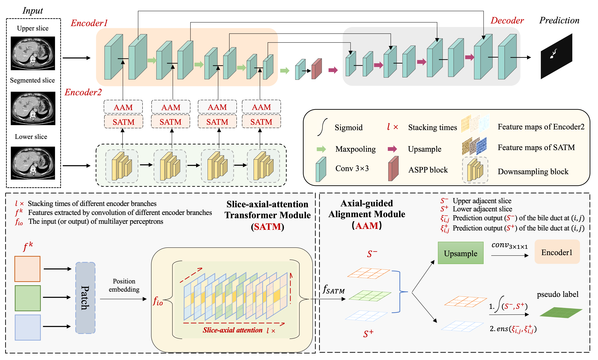
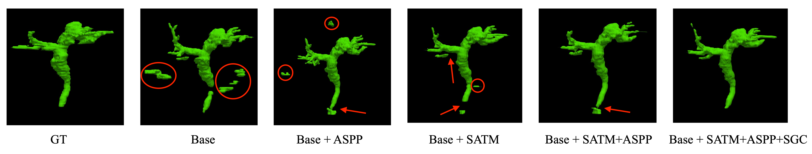

## TAGNet: A transformer-based axial guided network for bile duct segmentation

Implementation of [TAGNet](https://www.sciencedirect.com/science/article/abs/pii/S1746809423006778) in Pytorch, a bile duct segmentation model based on CNN and Transformer hybrid architecture network. The paper has been accepted on [here](https://www.sciencedirect.com/science/article/abs/pii/S1746809423006778).



### Data Prepocessing

Considering the privacy issues involved in the data, the bile duct dataset is not made public. You can train and test the model on some publicly available liver vascular datasets (CT images).

#### Data directory format

---code

​	**&emsp**---TAGNet source code

---data

​	**&emsp**---imagesTr

​		**&emsp** **&emsp**---BileDuct_xxx_volume.nii.gz

​	**&emsp**---imagesTs

​		**&emsp** **&emsp**---BileDuct_xxx_volume.nii.gz

​	**&emsp**---labelsTr

​		**&emsp** **&emsp**---BileDuct_xxx_label.nii.gz

​	**&emsp**---labelsTs

​		**&emsp** **&emsp**---BileDuct_xxx_label.nii.gz

​	**&emsp**---mask

​		**&emsp** **&emsp**---BileDuct_xxx_liver.nii.gz

​	**&emsp**---dataset.json

The `xxx` represents the serial number of the raw data. The file `dataset.json` stores path information for each data and will be generated while preprocessing raw data (CT images). 

#### Data preprocess

You can preprocess your own data via:

```shell
python preprocessor.py --root_dir your_data_root_dir --dataset your_dataset_name
```

We also implement different data preprocessing methods (in the folder named preprocess), represented by the parameter `process_type`.

`--process_type: 2D`  Do not interpolate raw data, only resize and normalize are performed.

`--process_type: 2.5D`  Do interpolation on the z axis to the raw data.

`--process_type: 3D` Do interpolation for the xyz axis. 

### Model Training

You can train the model with the following statement:

```shell
python -W ignore train.py --model TAGNet --batch_size 8 --lr 0.01 --epoch 300 --patience 50 --loss_func sat --model_remark dice --gpu 6 7
```

**Parameter Description**

`--model` Model name.

`--batch_size` Batch size.

`--lr` Learning rate.

`--epoch` Maximum number of epochs for training.

`--patience` Maximum number of steps for training early stopping. If there is no lower loss update for periods exceeding the set value during training, stop training to prevent overfitting.

`--loss_func` Loss function.

`--model_remark` This is a free option. When training the same model, you may choose different loss functions or hyperparameters to verify the model performance. This parameter could store different models by adding a remark to the model.

`--gpu` Support for multi-GPU training.

### Inference

You can test the model with the following statement:

```shell
python -W ignore test.py --model TAGNet --best --gpu 7 --model_remark dice --postprocess [Optional] --save_infer [Optional] --save_csv [Optional]
```

**Optional Parameters Description**

`--postprocess` Post-processing the results of inference.

`--save_infer` Store inference results in the form of nii.gz.

`save_csv` Export the quantitative evaluation results of inference to a file.


Also, you can  generate more detailed quantitative evaluation results (non-post-processing and post-processing) through `summary.py`, and generate a json file to store the results via:

```shell
python summary.py
```

Before running the py file, you need to manually specify the output path of the file (`predict_path`), the path of the ground truth (`gt_path`), and the model name (`model_name`) in the code.

### Segmentation Results




### Citation

```
@article{ZHOU2023105244,
title = {TAGNet: A transformer-based axial guided network for bile duct segmentation},
journal = {Biomedical Signal Processing and Control},
volume = {86},
pages = {105244},
year = {2023},
issn = {1746-8094},
doi = {https://doi.org/10.1016/j.bspc.2023.105244},
url = {https://www.sciencedirect.com/science/article/pii/S1746809423006778},
author = {Guang-Quan Zhou and Fuxing Zhao and Qing-Han Yang and Kai-Ni Wang and Shengxiao Li and Shoujun Zhou and Jian Lu and Yang Chen},
keywords = {Bile duct, Medical image segmentation, Axial attention, Transformer, Deep learning},
}
```

